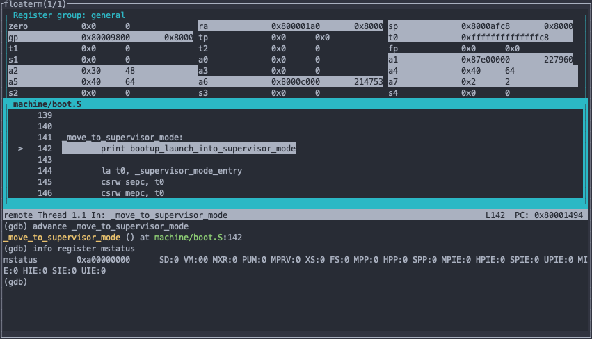

# PseudOS

PseudOS is a toy operating system based on the following resources:
 - https://www.youtube.com/watch?v=s_4tFz52jbc
 - xv6

## Prerequisites
PseudOS runs on QEMU and needs a riscv64 toolchain to compile. See https://www.qemu.org/docs/master/system/riscv/virt.html for more details

## Compiling the bootloader
Running `make` should take care of everything

See the `makefile` for compilation details

## Running
Again, make should automatically run the OS. If you're constantly iterating on the code (like I am) and QEMU doesn't auto-quit on OS crash, I've included a `qemu destroyer` bash script which can run in another terminal tab and continuously `pkill`s qemu. Just a quality of life thing.

## Debugging

If you want to inspect QEMU to see what's going on under the hood, use the following commands:

First, run 

`make pseudOS_debug` 

which will compile the OS with debugging symbols on and no optimizations. The `-S` command in the makefile will hold QEMU on startup and not execute any code until we've connected with gdb.

In a separate terminal window, start gdb: `riscv64-unknown-elf-gdb build/kernel.elf `

Connect to the QEMU session with the command

    (gdb) target remote localhost:9000

Use this command to activate GDB's display of source and registers

    (gdb) tui reg general

Skip to some interesting code with with

    (gdb) advance _move_to_supervisor_mode

Get the status of specific CSR registers

    (gdb) info registers mstatus

(Optional) Set up gdbgui (https://www.gdbgui.com/) to have a GUI not from the 80s. It also supports vim keybindings for those who prefer it to gdb's emacs bindings.

Ref:
- https://spivey.oriel.ox.ac.uk/compilers/Single-stepping_with_QEMU_and_GDB
- https://jvns.ca/blog/2021/05/17/how-to-look-at-the-stack-in-gdb/
